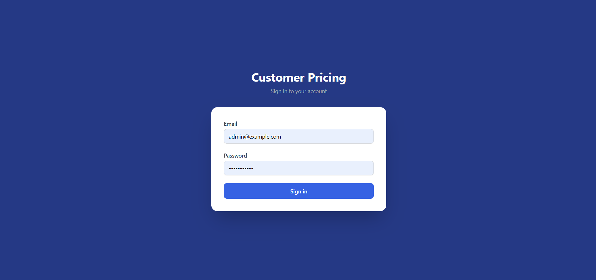
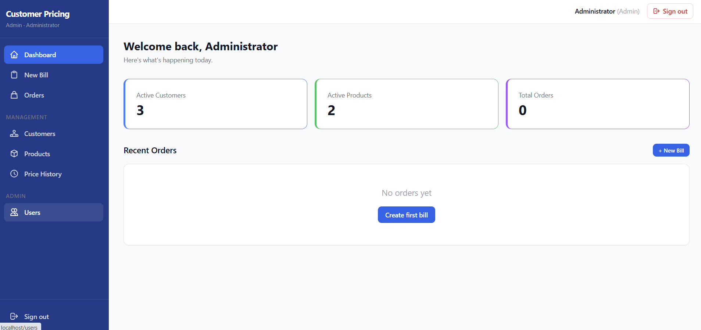
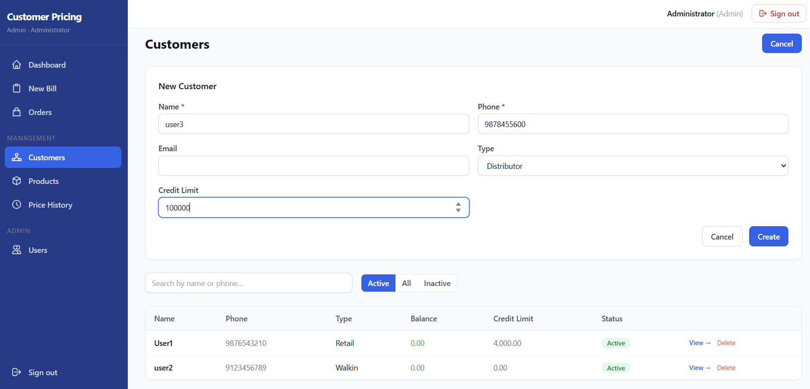
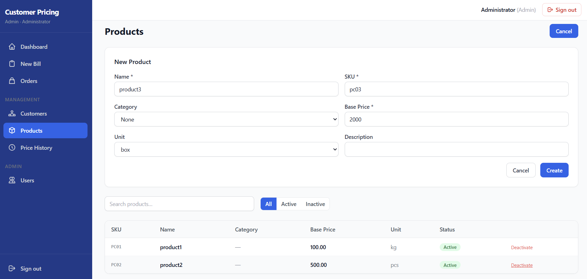

# Customer Pricing System

A production-grade, standalone customer-based dynamic pricing application built with Django, React, PostgreSQL, and Docker. Inspired by Odoo's precision and security standards — without the Odoo dependency.

> **One-click deployment.** Double-click `start.bat` and the browser opens automatically.

---

## Table of Contents

- [Overview](#overview)
- [Screenshots](#screenshots)
- [Features](#features)
- [Tech Stack](#tech-stack)
- [Architecture](#architecture)
- [Getting Started](#getting-started)
- [Environment Variables](#environment-variables)
- [API Reference](#api-reference)
- [Role-Based Access](#role-based-access)
- [Key Design Decisions](#key-design-decisions)
- [Code Highlights](#code-highlights)
- [Project Structure](#project-structure)
- [Contributing](#contributing)
- [License](#license)

---

## Overview

Customer Pricing System allows businesses to manage **per-customer product pricing**, track every price change with a full **immutable audit trail**, monitor **customer credit balances**, and process bills from a fast **cashier screen** — all in one locally-deployed app.

Each customer gets a dedicated pricelist. When the cashier selects a customer on the billing screen and searches for a product, the customer-specific price auto-fills. Prices can be overridden per transaction, and every change is permanently logged.

---

## Screenshots

### Login


### Dashboard


### Customer Profile — Ledger & Prices


### Products


---

## Features

### Billing
- Search customer by **phone number** — instant lookup
- Search products by **name or SKU** with live autocomplete
- Prices **auto-fill** from customer's pricelist; fall back to base price
- Cashier can **override** the price (tracked as `is_price_overridden`)
- One-click **Confirm & Bill** — atomically confirms order and posts credit ledger entry

### Pricing
- Each customer gets a **dedicated pricelist** (auto-created on first price set)
- Set or update a product price for any customer via the **Set Price** wizard
- Prices include `effective_from` / `effective_to` date range support

### Price History (Immutable)
- Every price change is **permanently logged** — old price, new price, version number, who changed it, when
- Records **cannot be edited or deleted** (enforced at both application and database level)
- Version number **auto-increments** per customer + product pair

### Credit Ledger
- Append-only ledger: `credit` (sale) / `payment` (received) / `adjustment` (manual)
- **Outstanding balance** computed live from all ledger entries
- Credit limit tracking with over-limit detection
- Post payments directly from the Customer Profile screen

### Role-Based Access
| Feature | Cashier | Manager | Admin |
|---|:---:|:---:|:---:|
| New Bill | ✓ | ✓ | ✓ |
| View own orders | ✓ | ✓ | ✓ |
| View all orders | — | ✓ | ✓ |
| Customers | — | ✓ | ✓ |
| Products | — | ✓ | ✓ |
| Price History | — | ✓ | ✓ |
| Set Prices | — | ✓ | ✓ |
| User Management | — | — | ✓ |

### Security
- JWT authentication with **automatic silent refresh**
- **Token blacklisting** on logout
- Role-based permissions enforced on **every API endpoint**, not just the UI
- Database-level `CHECK` constraints on all critical fields
- Soft-delete (archive) instead of hard delete — no accidental data loss
- Security headers (X-Frame-Options, X-Content-Type-Options, Referrer-Policy)

---

## Tech Stack

| Layer | Technology |
|---|---|
| **Backend** | Python 3.12, Django 5.2 LTS, Django REST Framework |
| **Auth** | djangorestframework-simplejwt (JWT + token blacklist) |
| **Database** | PostgreSQL 16 |
| **Frontend** | React 18, Vite 5, TailwindCSS 3 |
| **HTTP Client** | Axios (with interceptor-based silent refresh) |
| **Web Server** | Nginx 1.27 (reverse proxy + static file serving) |
| **App Server** | Gunicorn 23 |
| **Containerisation** | Docker, Docker Compose |

---

## Architecture

```
┌─────────────────────────────────────────────────────────┐
│                      Browser                            │
└────────────────────────┬────────────────────────────────┘
                         │ HTTP :80
┌────────────────────────▼────────────────────────────────┐
│               Nginx (frontend container)                 │
│  • Serves React SPA (built static files)                │
│  • Proxies /api/* → backend:8000                        │
└────────────────────────┬────────────────────────────────┘
                         │ HTTP :8000
┌────────────────────────▼────────────────────────────────┐
│           Django + Gunicorn (backend container)          │
│  ┌──────────┐ ┌──────────┐ ┌──────────┐ ┌──────────┐  │
│  │  users   │ │ products │ │customers │ │ pricing  │  │
│  └──────────┘ └──────────┘ └──────────┘ └──────────┘  │
│                        ┌──────────┐                     │
│                        │  orders  │                     │
│                        └──────────┘                     │
└────────────────────────┬────────────────────────────────┘
                         │ TCP :5432
┌────────────────────────▼────────────────────────────────┐
│                 PostgreSQL (db container)                │
│                  Volume: postgres_data                   │
└─────────────────────────────────────────────────────────┘
```

All three containers are managed by Docker Compose. Data is persisted in a named Docker volume — stopping/restarting the app never loses data.

---

## Getting Started

### Prerequisites

- [Docker Desktop](https://www.docker.com/products/docker-desktop) (Windows)
- That's it.

### Launch

```bat
start.bat
```

The script will:
1. Detect if Docker Desktop is running — starts it automatically if not
2. Build all three containers (`db`, `backend`, `frontend`)
3. Run database migrations
4. Create the default admin user
5. Wait for the health check to pass
6. Open `http://localhost` in your browser

### Stop

```bat
stop.bat
```

All containers stop. Your data is preserved in the Docker volume.

### Default Login

| Field | Value |
|---|---|
| URL | `http://localhost` |
| Email | `admin@example.com` |
| Password | `Admin@2026!` |

> **Change the admin password immediately after first login via Users → your profile.**

---

## Environment Variables

All variables live in `.env` at the project root. Copy `.env.example` for a clean template.

| Variable | Description | Default |
|---|---|---|
| `SECRET_KEY` | Django secret key — **change this** | — |
| `DEBUG` | Enable debug mode | `False` |
| `ALLOWED_HOSTS` | Comma-separated allowed hosts | `localhost,127.0.0.1` |
| `DB_NAME` | PostgreSQL database name | `customer_pricing` |
| `DB_USER` | PostgreSQL user | `pricing_user` |
| `DB_PASSWORD` | PostgreSQL password — **change this** | — |
| `DB_HOST` | Database host (use `db` for Docker) | `db` |
| `DB_PORT` | Database port | `5432` |
| `JWT_ACCESS_TOKEN_LIFETIME_MINUTES` | Access token TTL | `30` |
| `JWT_REFRESH_TOKEN_LIFETIME_DAYS` | Refresh token TTL | `7` |
| `ADMIN_EMAIL` | Initial admin email | `admin@example.com` |
| `ADMIN_PASSWORD` | Initial admin password | `Admin@2026!` |

---

## API Reference

All endpoints are prefixed with `/api/v1/`. All responses follow a consistent envelope:

```json
// Success
{ "success": true, "data": { ... } }

// Error
{
  "success": false,
  "error": {
    "code": "validation_error",
    "message": "Price cannot be negative.",
    "detail": { "price": ["This field is required."] }
  }
}
```

### Authentication

| Method | Endpoint | Description |
|---|---|---|
| `POST` | `/auth/login/` | Obtain access + refresh tokens |
| `POST` | `/auth/refresh/` | Refresh access token |
| `POST` | `/auth/logout/` | Blacklist refresh token |

**Login request/response:**
```json
// POST /api/v1/auth/login/
{ "email": "admin@example.com", "password": "Admin@2026!" }

// Response
{
  "access": "eyJ...",
  "refresh": "eyJ...",
  "user": { "id": 1, "name": "Administrator", "email": "admin@example.com", "role": "admin" }
}
```

### Customers

| Method | Endpoint | Description | Roles |
|---|---|---|---|
| `GET` | `/customers/` | List customers | All |
| `POST` | `/customers/` | Create customer | Manager+ |
| `GET` | `/customers/{id}/` | Get customer | All |
| `PATCH` | `/customers/{id}/` | Update customer | Manager+ |
| `GET` | `/customers/lookup/?phone=07xx` | Phone lookup (billing screen) | All |
| `GET` | `/customers/{id}/ledger/` | Customer ledger entries | Manager+ |
| `POST` | `/customers/{id}/ledger/` | Post payment / adjustment | Manager+ |

### Products

| Method | Endpoint | Description | Roles |
|---|---|---|---|
| `GET` | `/products/` | List products | All |
| `POST` | `/products/` | Create product | Manager+ |
| `PATCH` | `/products/{id}/` | Update product | Manager+ |
| `DELETE` | `/products/{id}/` | Deactivate product | Manager+ |
| `GET` | `/products/categories/` | List categories | All |

### Pricing

| Method | Endpoint | Description | Roles |
|---|---|---|---|
| `GET` | `/pricing/lookup/?customer_id=&product_id=` | Get effective price | All |
| `POST` | `/pricing/set-price/` | Set customer product price | Manager+ |
| `GET` | `/pricing/pricelist/{customer_id}/` | Full customer pricelist | All |
| `GET` | `/pricing/history/` | Price history log | All |
| `GET` | `/pricing/history/?customer=1` | Filter by customer | All |

**Set price (wizard endpoint):**
```json
// POST /api/v1/pricing/set-price/
{
  "customer_id": 3,
  "product_id": 7,
  "price": "450.00",
  "effective_from": "2026-03-09"
}
```

**Price lookup response:**
```json
{
  "success": true,
  "data": {
    "product_id": 7,
    "product_name": "Basmati Rice 5kg",
    "price": "450.00",
    "base_price": "500.00",
    "is_custom_price": true
  }
}
```

### Orders

| Method | Endpoint | Description | Roles |
|---|---|---|---|
| `GET` | `/orders/` | List orders | All (cashiers see own) |
| `POST` | `/orders/` | Create draft order | All |
| `GET` | `/orders/{id}/` | Get order detail | All |
| `POST` | `/orders/{id}/confirm/` | Confirm + post ledger | All |
| `POST` | `/orders/{id}/mark-paid/` | Mark as paid | Manager+ |
| `POST` | `/orders/{id}/cancel/` | Cancel draft | Manager+ |
| `POST` | `/orders/{order_id}/items/` | Add item to draft | All |

---

## Role-Based Access

Roles are embedded in the JWT payload — the frontend reads them to render the correct UI. The backend enforces them independently on every request.

```
admin
  └── Full access + user management

manager
  └── Products, customers, pricing, all orders, ledger

cashier
  └── New bill, own orders only
```

The permission classes (`IsAdmin`, `IsManagerOrAbove`, `IsAnyRole`, `ReadOnly`) are composable with DRF's `|` operator:

```python
# manager/admin can write; all roles can read
permission_classes = [IsAuthenticated, IsManagerOrAbove | ReadOnly]
```

---

## Key Design Decisions

### Immutable Price History
Every price change creates a new `PriceHistory` record. Updates and deletes are blocked at the model level — attempting either raises `PermissionDenied`. This matches Odoo's approach of never allowing write/unlink on audit models.

```python
def save(self, *args, **kwargs):
    if self.pk:
        raise PermissionDenied("Price history records are immutable.")
    super().save(*args, **kwargs)

def delete(self, *args, **kwargs):
    raise PermissionDenied("Price history records cannot be deleted.")
```

### Atomic Order Confirmation
Confirming an order and posting the credit ledger entry happen in a single database transaction. Either both succeed or neither does — no partial state.

```python
def confirm(self):
    with transaction.atomic():
        self.status = self.STATUS_CONFIRMED
        self.confirmed_at = timezone.now()
        self.save()
        CreditLedger.objects.create(
            customer=self.customer,
            entry_type="credit",
            amount=self.total_amount,
            order=self,
        )
```

### Auto Audit Fields (thread-local user)
Every model inherits `AuditModel` which automatically stamps `created_by` / `updated_by` from the request user — without passing the user explicitly through every save call. Inspired directly by Odoo's `self.env.user`.

```python
# middleware.py — stores user in thread-local on every request
set_current_user(request.user)

# models.py — AuditModel reads it automatically
def save(self, *args, **kwargs):
    user = get_current_user()
    if user:
        if not self.pk:
            self.created_by = user
        self.updated_by = user
    super().save(*args, **kwargs)
```

### Price Auto-fill with Override Tracking
When the cashier adds a product to a bill, the system calls `GET /pricing/lookup/` to fetch the customer-specific price (falling back to base price). If the cashier changes the price, `is_price_overridden=True` is stored on the order line — providing a clean audit trail of manual interventions.

### Soft Delete Everywhere
No record is ever hard-deleted. Customers, products, and users are deactivated (`is_active=False`). Orders use `on_delete=PROTECT` on the customer FK — archiving a customer never cascades into their order history.

---

## Code Highlights

### Backend — Outstanding Balance (one DB query)
```python
# customers/models.py
@property
def outstanding_balance(self):
    result = self.credit_ledger.aggregate(
        balance=Sum(
            Case(
                When(entry_type="credit",     then="amount"),
                When(entry_type="payment",    then=F("amount") * Value(-1)),
                When(entry_type="adjustment", then="amount"),
                default=Value(0),
                output_field=DecimalField(),
            )
        )
    )
    return result["balance"] or 0
```

### Backend — Auto price history on save
```python
# pricing/models.py
def save(self, *args, **kwargs):
    is_new = self.pk is None
    old_price = None
    if not is_new:
        old_price = PricelistItem.objects.values_list("price", flat=True).get(pk=self.pk)
    super().save(*args, **kwargs)
    if is_new or old_price != self.price:
        self._log_price_history(old_price or Decimal("0.00"), is_new)
```

### Frontend — Silent JWT refresh (Axios interceptor)
```javascript
// api/client.js
client.interceptors.response.use(
  (response) => response,
  async (error) => {
    const original = error.config
    if (error.response?.status === 401 && !original._retry) {
      original._retry = true
      const { data } = await axios.post('/api/v1/auth/refresh/', { refresh })
      localStorage.setItem('access', data.access)
      original.headers.Authorization = `Bearer ${data.access}`
      return client(original)   // retry original request transparently
    }
    return Promise.reject(error)
  }
)
```

### Frontend — Price auto-fill on product select
```javascript
// pages/NewBill.jsx
const addProduct = async (product) => {
  let price = Number(product.base_price)
  if (customer) {
    const { data } = await lookupPrice(customer.id, product.id)
    price = Number(data.data.price)   // customer-specific or base_price
  }
  setLines((prev) => [...prev, { ...product, unit_price: price }])
}
```

---

## Project Structure

```
customer-pricing/
├── start.bat                      # One-click launcher
├── stop.bat                       # One-click shutdown
├── docker-compose.yml
├── .env                           # Credentials (never commit this)
│
├── backend/
│   ├── Dockerfile
│   ├── requirements.txt
│   ├── manage.py
│   ├── entrypoint.sh              # Migrations + gunicorn startup
│   ├── create_admin.py            # Idempotent admin creation
│   ├── config/
│   │   ├── settings/
│   │   │   ├── base.py            # Shared settings
│   │   │   ├── development.py
│   │   │   └── production.py
│   │   ├── urls.py
│   │   └── wsgi.py
│   └── apps/
│       ├── core/                  # AuditModel, permissions, middleware, exceptions
│       ├── users/                 # Custom User model, JWT views
│       ├── products/              # Product, ProductCategory
│       ├── customers/             # Customer, CreditLedger
│       ├── pricing/               # CustomerPricelist, PricelistItem, PriceHistory
│       └── orders/                # Order, OrderItem
│
├── frontend/
│   ├── Dockerfile                 # Multi-stage: Node build → Nginx serve
│   ├── nginx.conf
│   ├── package.json
│   ├── vite.config.js
│   ├── tailwind.config.js
│   └── src/
│       ├── api/                   # client.js, auth.js, products.js, ...
│       ├── context/               # AuthContext (JWT state)
│       ├── components/            # Layout, Sidebar, ProtectedRoute
│       └── pages/
│           ├── Login.jsx
│           ├── Dashboard.jsx
│           ├── NewBill.jsx        # Cashier billing screen
│           ├── Orders.jsx
│           ├── Customers.jsx
│           ├── CustomerProfile.jsx
│           ├── Products.jsx
│           ├── PriceHistory.jsx
│           └── Users.jsx
│
└── docs/
    └── screenshots/               # Add your screenshots here
```

---

## Contributing

1. Fork the repository
2. Create a feature branch: `git checkout -b feature/your-feature`
3. Make your changes
4. Verify the app runs: `start.bat`
5. Commit: `git commit -m "Add your feature"`
6. Push and open a Pull Request

### Backend conventions
- All models inherit `AuditModel` for automatic audit fields
- Never hard-delete business records — use `is_active = False`
- All write operations must check `IsManagerOrAbove` or `IsAdmin` permissions
- Wrap multi-step DB operations in `transaction.atomic()`
- Add `CheckConstraint` at the model level for every numeric field with a valid range

### Frontend conventions
- All API calls go through `src/api/client.js` — never use raw `fetch`
- Role-based UI uses `useAuth()` — `isAdmin`, `isManager`, `isCashier`
- New pages go in `src/pages/`, new reusable components in `src/components/`

---

## License

MIT License — see [LICENSE](LICENSE) for details.

---

<p align="center">
  Built with Django · React · PostgreSQL · Docker
</p>
