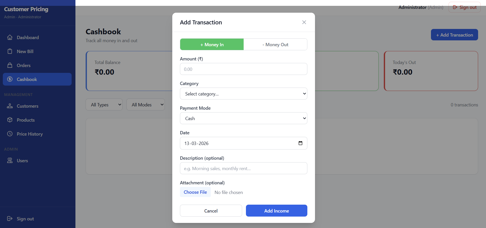

# MERI DIGITAL DUKAN ROS

A lightweight business operations web application for small to medium retail and wholesale businesses. Inspired by the workflow of **Khatabook** and **Odoo 18**, adapted into a self-hosted, Dockerized web app.

---

## Screenshots

| Login | Dashboard |
|-------|-----------|
|  |  |

| Cashbook | Customer Profile |
|----------|-----------------|
|  |  |

| Products |
|----------|
|  |

---

## Features

| Problem | Solution |
|---------|----------|
| Cashiers need different prices per customer | Per-customer price lists with full change history |
| Manager needs to track daily cash in/out | Cashbook with categories and payment modes |
| Supplier invoices need to sync with finances | Purchase invoices auto-create cashbook entries on payment |
| Supplier payments need to be tracked | Supplier payment ledger linked to cashbook |
| Customer credit balances need tracking | Credit ledger per customer |
| Multiple staff, different access levels | Three-role system: Admin / Manager / Cashier |

### User Roles

| Role | Access |
|------|--------|
| **Cashier** | New Bill, own Orders, own Cashbook entries |
| **Manager** | All above + Customers, Products, Pricing, Suppliers, full Cashbook |
| **Admin** | All above + User management |

---

## Tech Stack

**Backend:** Python 3.12, Django 5.2, Django REST Framework, PostgreSQL 16, JWT auth, Gunicorn

**Frontend:** React 18, Vite, Tailwind CSS, React Router 6, Axios

**Infrastructure:** Docker Compose, Nginx 1.27 (reverse proxy + SPA server), Render.com (cloud target)

---

## Architecture

```
Browser
  |
  | HTTP :80
  v
[Nginx Container]           ← serves built React SPA
  |
  | /api/v1/* proxy_pass
  v
[Django/Gunicorn Container] ← REST API (3 workers)
  |
  | psycopg3
  v
[PostgreSQL 16 Container]   ← persistent data (Docker volume)
```

All three services run in a single Docker Compose stack. The frontend Nginx container proxies all `/api/v1/` requests to the backend — no direct browser-to-backend connection in production.

---

## Getting Started

### Prerequisites

- [Docker Desktop](https://www.docker.com/products/docker-desktop/) installed and running
- Windows 10/11

### 1. Clone and configure

```bash
git clone <repo-url>
cd customer-pricing
cp .env.example .env
# Edit .env and set SECRET_KEY, DB_PASSWORD, ADMIN_EMAIL, ADMIN_PASSWORD
```

### 2. Start

Double-click `start.bat`, or from a terminal:

```bat
start.bat
```

The script checks for Docker, starts Docker Desktop if needed, then runs `docker compose up --build -d`.

Open the app at **http://localhost**

Django Admin is available at **http://localhost/admin/**

### 3. Stop

```bat
stop.bat
```

### Force rebuild after code changes

```bat
docker compose build --no-cache
docker compose up -d
```

---

## Environment Variables

Copy `.env.example` to `.env` and fill in your values:

```env
SECRET_KEY=change-me-to-a-long-random-string
DEBUG=False
ALLOWED_HOSTS=localhost,127.0.0.1

DB_NAME=customer_pricing
DB_USER=pricing_user
DB_PASSWORD=change-me-strong-password
DB_HOST=db
DB_PORT=5432

CORS_ALLOWED_ORIGINS=http://localhost,http://127.0.0.1

JWT_ACCESS_TOKEN_LIFETIME_MINUTES=30
JWT_REFRESH_TOKEN_LIFETIME_DAYS=7
```

---

## Running Tests

**Backend** (inside the running container):

```bash
docker exec -it customer-pricing-backend-1 pytest
```

Or locally with Python dependencies installed:

```bash
cd backend
pytest
```

**Frontend:**

```bash
cd frontend
npm test
```

---

## Project Structure

```
customer-pricing/
├── start.bat                  # Start all containers
├── stop.bat                   # Stop all containers
├── docker-compose.yml
├── render.yaml                # Render.com deployment config
├── .env.example
│
├── backend/
│   ├── Dockerfile
│   ├── entrypoint.sh          # DB wait → migrations → collectstatic → gunicorn
│   ├── requirements.txt
│   └── apps/
│       ├── core/              # AuditModel, permissions, throttling, middleware
│       ├── users/             # Custom User model, JWT auth, role management
│       ├── products/          # Product catalogue, categories, quick-products
│       ├── customers/         # Customer profiles, credit ledger
│       ├── pricing/           # Per-customer price lists and history
│       ├── orders/            # Sales order lifecycle (draft → confirmed → paid)
│       ├── cashbook/          # Daily cash flow ledger (IN/OUT, categories, modes)
│       └── suppliers/         # Suppliers, purchase invoices, payments, ledger
│
└── frontend/
    ├── Dockerfile
    ├── nginx.conf
    └── src/
        ├── api/               # Axios API clients (one file per domain)
        ├── context/           # AuthContext (useAuth hook)
        ├── components/        # Layout, modals, panels, shared UI
        └── pages/             # Login, Dashboard, NewBill, Orders, Cashbook,
                               # Customers, Products, Suppliers, Users, ...
```

---

## API Overview

All endpoints are versioned at `/api/v1/`. Authentication uses JWT (Bearer token).

| Domain | Base Path |
|--------|-----------|
| Auth | `/api/v1/auth/` |
| Users | `/api/v1/users/` |
| Products | `/api/v1/products/` |
| Customers | `/api/v1/customers/` |
| Pricing | `/api/v1/pricing/` |
| Orders | `/api/v1/orders/` |
| Cashbook | `/api/v1/cashbook/` |
| Suppliers | `/api/v1/suppliers/` |
| Purchases | `/api/v1/purchases/` |
| Health | `/api/v1/health/` |

**Response convention:**
- Mutations (POST/PATCH/actions): `{ "success": true, "data": { ... } }`
- List endpoints: `{ "count": N, "next": null, "previous": null, "results": [...] }`

---

## Viewing Logs

```bash
docker logs customer-pricing-backend-1 -f
docker logs customer-pricing-frontend-1 -f
```

---

## License

[MIT](LICENSE)
